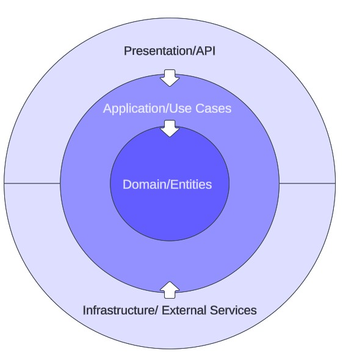

DfE RSD Domain-Driven Design (DDD) Clean Architecture Template
==========================================================================

How to Use the DDD Clean Architecture Template
----------------------------------------------

This template provides a solid foundation for building .NET Web APIs using Domain-Driven Design (DDD) and Clean Architecture principles. Follow the steps below to create a new project based on this template.

### Step 1: Clone the Repository

First, clone the repository to a temporary location on your machine. This will give you access to the template files.

    git clone https://github.com/DFE-Digital/rsd-ddd-clean-architecture.git

### Step 2: Install the Template

Navigate to the root of the cloned repository where the `.template.config` directory is located. Then, run the following command to install the template into your local .NET environment:

    dotnet new -i ./

This command will install the template so you can use it to generate new projects.

### Step 3: Create a New Project from the Template

Navigate to the directory where you want to create your new project. Once you're in the desired directory, run the following command:

    dotnet new rsd-ddd-ca-webapi -n YourProjectName -o ./

*   Replace `YourProjectName` with the desired name for your new project.
*   The `-o ./` flag ensures that the new project is created in the current directory.

After running this command, a new project based on the template will be generated, complete with the folder structure, configurations, and code necessary to start developing your application.

### Step 4 (optional): Dockerfile

If you want to use the template Dockerfile for building your .NET app then you can must update the `REPO_ORIGIN` build arguments in the file

**Dockerfile** - Option 1

```diff
-ARG REPO_ORIGIN="https://github.com/DFE-Digital/rsd-ddd-clean-architecture"
+ARG REPO_ORIGIN="https://github.com/DFE-Digital/My.NewProject.Api"
```

**Dockerfile** - Option 2

```shell
docker build --build-arg REPO_ORIGIN="https://github.com/DFE-Digital/My.NewProject.Api" .
```

User Manual
----------------------------------------------

This manual is intended to provide a comprehensive overview of the architecture, design principles, and key components of the DfE Domain-Driven Design (DDD) Clean Architecture Template. This document is designed to help new developers understand the structure, purpose, and functionality of the template, making it easier to create new projects based on this architecture.

Table of Contents
-----------------

*   [Architecture Overview](#1-architecture-overview)
*   [Project Structure and Folder Organization](#2-project-structure-and-folder-organization)
*   [Responsibilities of Each Layer](#3-responsibilities-of-each-layer)
*   [Business Logic Flow](#4-business-logic-flow)
*   [Value Objects and Strongly Typed IDs](#5-value-objects-and-strongly-typed-ids)
*   [Validators](#6-validators)
*   [Code-First Approach and Design-Time DbContext Factory](#7-code-first-approach-and-design-time-dbcontext-factory)
*   [Generic Repository Pattern](#8-generic-repository-pattern)
*   [Caching Strategy](#9-caching-strategy)
*   [Authentication and Authorization](#10-authentication-and-authorization)
*   [NSwag and Strongly Typed Client Generation](#11-nswag-and-strongly-typed-client-generation)
*   [Background Task Factory and Event-Driven Notifications](#12-background-task-factory-and-event-driven-notifications)
*   [Testing Strategy](#13-testing-strategy)
*   [Integration Testing and End-to-End (E2E) Testing](#14-integration-testing-and-end-to-end-e2e-testing)

1\. Architecture Overview
-------------------------

The project follows the principles of Clean Architecture combined with Domain-Driven Design (DDD). The architecture is designed to enforce separation of concerns, maintainability, testability, and scalability. The core idea is to keep the business logic (Domain) at the center, insulated from external concerns such as data access, user interfaces, and frameworks.



Key principles include:

*   **Independence of Frameworks**: The business logic should not depend on any particular framework, allowing the application to be easily adaptable to different frameworks or platforms.
*   **Testability**: The architecture is designed to facilitate unit testing, integration testing, and end-to-end testing.
*   **Separation of Concerns**: Each layer in the architecture has a distinct responsibility, which helps in maintaining the codebase.
*   **Flexibility and Extensibility**: New features can be added with minimal impact on existing functionality.

2\. Project Structure and Folder Organization
---------------------------------------------

The `src` directory contains the main projects and components of the architecture:

*   **Benchmarks**: Contains performance benchmarking tests.
*   **DfE.DomainDrivenDesignTemplate.Api.Client**: The generated client code that provides strongly-typed access to the API endpoints, using NSwag.
*   **DfE.DomainDrivenDesignTemplate.Api**: The main Web API project where controllers, middleware, and configuration are defined.
*   **DfE.DomainDrivenDesignTemplate.Application**: Contains application-specific logic, such as commands, queries, and handlers. This layer interacts with the Domain and Infrastructure layers.
*   **DfE.DomainDrivenDesignTemplate.Domain**: The core business logic, including entities, value objects, aggregates, domain events, and repository interfaces.
*   **DfE.DomainDrivenDesignTemplate.Infrastructure**: Implements the data access and other external service integrations. It bridges the gap between the Domain and Application layers.
*   **DfE.DomainDrivenDesignTemplate.Utils**: Utility classes and helpers used across the application.
*   **Tests**: Contains various testing projects, including unit tests, integration tests, and end-to-end tests.

3\. Responsibilities of Each Layer
----------------------------------

*   **Domain Layer**:
    *   The heart of the business logic. Contains entities, value objects, aggregates, domain events, and repository interfaces.
    *   Enforces business rules and maintains the integrity of the business state.
    *   Implements core DDD patterns like Aggregates and Entities.
*   **Application Layer**:
    *   Orchestrates application-specific use cases and business processes.
    *   Contains commands, queries, handlers, and service interfaces.
    *   Serves as the intermediary between the Domain and Infrastructure layers.
    *   Implements the CQRS pattern by separating commands (write operations) and queries (read operations).
*   **Infrastructure Layer**:
    *   Implements data access logic, external services, and repositories.
    *   Contains the actual implementations for repository interfaces defined in the Domain layer.
    *   Deals with cross-cutting concerns like logging, caching, and emailing.
*   **API Layer**:
    *   Exposes the application's functionality via RESTful endpoints.
    *   Defines controllers that interact with the Application layer using MediatR to handle requests.
    *   Manages authentication, authorization, and API documentation (via Swagger).

4\. Business Logic Flow
-----------------------

### Example: Flow of a Request to Create a School

1.  **API Layer**:
    *   A client sends a `POST` request to the `SchoolsController` to create a new school.
    *   The request is mapped to a `CreateSchoolCommand` object and validated via `CreateSchoolCommandValidator`.
2.  **Application Layer**:
    *   The `CreateSchoolCommandHandler` receives the command.
    *   It invokes the `Create` method on the `School` aggregate root, which validates the input, creates the necessary entities, and raises domain events.
3.  **Domain Layer**:
    *   The `School` aggregate root performs any necessary business validations via the `SchoolCreateValidator`.
    *   The `School` entity is created, and domain events (e.g., `SchoolCreatedEvent`) are raised.
4.  **Infrastructure Layer**:
    *   The `ISclRepository<School, SchoolId>` saves the new `School` entity to the database.
    *   Any domain events are published via a domain event dispatcher in an interceptor after the transaction is completed.
5.  **API Response**:
    *   The `CreateSchoolCommandHandler` returns the `SchoolId` of the newly created school.
    *   The controller sends a `201 Created` response back to the client with the `SchoolId`.

5\. Value Objects and Strongly Typed IDs
----------------------------------------

The project uses value objects and strongly typed IDs to enforce business rules and provide type safety.

*   **Value Objects**:
    *   Immutable objects that represent descriptive aspects of the domain, such as `NameDetails`.
    *   Value objects do not have an identity and are compared by the values of their attributes.
*   **Strongly Typed IDs**:
    *   `TId` in the base entities represents a strongly typed ID, ensuring that only valid identifiers are used throughout the system.
    *   This approach prevents accidental misuse of IDs, improving the safety and clarity of the codebase.

6\. Validators
--------------

Validators are used extensively to ensure the integrity of the business logic:

*   **FluentValidation**: Validators like `SchoolCreateValidator` are implemented using FluentValidation, a popular library for complex validation logic.
*   **Centralized Validation**: Validation logic is centralized in validators, ensuring that business rules are enforced consistently across the application.

7\. Code-First Approach and Design-Time DbContext Factory
---------------------------------------------------------

The project uses a code-first approach with Entity Framework Core (EF Core) to manage database interactions. This approach has several benefits and is supported by the implementation of a design-time `DbContext` factory.

### Code-First Approach

*   **Code-First Development**: The code-first approach allows developers to define the database schema using C# classes and EF Core configurations. The database schema is generated and maintained through code, which provides several advantages:
    *   **Strongly Typed Models**: The database schema is strongly typed, reducing the likelihood of runtime errors due to schema mismatches.
    *   **Version Control**: Schema changes are tracked in source control alongside the code, making it easier to manage database versioning and migrations.
    *   **Flexibility**: Changes to the database schema can be made directly in code, and EF Core will handle generating the necessary migration scripts to apply those changes to the database.

### Design-Time DbContext Factory

*   **Design-Time Support**: A design-time `DbContext` factory is implemented to provide EF Core with the necessary context configuration at design time. This factory is used by tools such as the EF Core CLI to perform tasks like generating migrations and updating the database schema.
*   **Dependency Injection**: The factory allows for seamless integration with dependency injection. By providing the `DbContext` configuration at design time, it ensures that the same settings used at runtime are applied when generating migrations.
*   **Benefits**:
    *   **Consistency**: Ensures that the same database context configuration is used both at runtime and during design-time operations, reducing the chance of configuration discrepancies.
    *   **Automation**: Facilitates automated build and deployment processes by allowing migrations to be generated and applied as part of a CI/CD pipeline.
    *   **Scalability**: As the application grows, the design-time factory simplifies the management of multiple database contexts or environments (e.g., development, staging, production).

8\. Generic Repository Pattern
------------------------------

The project implements a generic repository pattern to enforce clean code and ensure that all repositories return aggregate roots:

*   **Generic Repository**:
    *   Provides a consistent interface for data access operations, such as `Add`, `Remove`, `Get`, and `Update`.
    *   Ensures that all data access is routed through the repository, maintaining a clean separation between the domain logic and data access.
*   **Enforcing Aggregate Roots**:
    *   By restricting repositories to work with aggregate roots, the design ensures that only complete and valid aggregates are persisted, maintaining the integrity of the domain.

9\. Caching Strategy
--------------------

Caching is implemented to optimize performance by reducing the number of database queries:

*   `ICacheService`: Provides a unified interface for caching operations.
*   `GetOrAddAsync`: Uses this pattern to cache results for subsequent requests, reducing the load on the database.
*   **Cache Duration Configuration**:

    *   The caching service reads the cache duration settings from the `appsettings.json` file.
    *   Each method or handler can have a specific cache duration defined in the configuration. For example, `GetPrincipalBySchoolQueryHandler` has a cache duration of 86400 seconds (24 hours).
    *   If a specific cache duration is not provided for a method, the service defaults to a globally defined `DefaultDurationInSeconds` value, which is set to 60 seconds by default.

10\. Authentication and Authorization
------------------------------------

The API layer integrates with authentication and authorization mechanisms:

*   **Authentication**: Likely integrated with a service like Azure AD for user management and token-based authentication.
*   **Authorization**: Managed via policies and roles, ensuring that only authorized users can access specific endpoints.
*   **Configuration of Roles and Claims**:
    *   Roles and claims expected from Azure AD can be configured in the `appsettings.json` file. This allows fine-grained control over who can access specific API endpoints.
    *   The configuration might look like this:


            "Authorization": {
                "Roles": [
                    "API.Read",
                    "API.Write"
                ]
            }


    *   Using the `[Authorize(Policy = "API.Write")]` attribute on a controller or action ensures that only users with the `API.Write` role can execute the action. This policy-based authorization integrates seamlessly with Azure AD roles and claims, enforcing security requirements directly at the API level.

11\. NSwag and Strongly Typed Client Generation
-----------------------------------------------

*   **NSwag**: Automatically generates a strongly-typed client based on the API's Swagger documentation.
*   **Strongly Typed Client**: Provides a convenient and type-safe way for clients to interact with the API, reducing the chances of runtime errors.
*   **Token Acquisition and Security**:
    *   The API client includes extension methods to automatically handle token acquisition and ensure secure API calls. These methods abstract away the complexity of dealing with token lifetimes and renewal.
    *   The client is configured to automatically retrieve and attach the necessary authentication token to each request. This is managed through an injected service, ensuring that every API call is authenticated without requiring the developer to manually handle tokens.
    *   The security implementation ensures that tokens are validated and renewed as necessary, reducing the risk of authentication failures due to expired tokens. This process is seamlessly integrated into the client, allowing developers to focus on business logic rather than security concerns.
*   **Automatic Client Generation**:
    *   When the main API project is built, it automatically generates the necessary client classes using the NSwag configuration file.
    *   This generation process is designed to run locally and is excluded from the CI/CD pipeline. This ensures that only versioned code is generated and committed to the source control repository.
    *   In the CI/CD pipeline, the `API.Client` project is packaged, versioned, and published to the NuGet feed using the `build-and-push-package-template.yml` file located in the `.github` folder.
    *   **Note**: For details on the implementation of this process, please consult your DevOps engineer or Farshad for guidance.

12\. Background Task Factory and Event-Driven Notifications
-----------------------------------------------------------

The application template includes a **Background Task Factory** to handle long-running operations asynchronously. This approach ensures that tasks, such as generating files or processing data, do not block the main execution flow. Once these background tasks are completed, event-driven notifications can trigger additional actions, such as sending emails or logging results.

*   **Background Task Factory**:
    *   The background task factory allows tasks to be queued up and processed one after the other. Multiple tasks can be enqueued from different sessions, and they will be executed sequentially, ensuring that resources are managed efficiently.
    *   This feature is beneficial for scenarios where long-running tasks, such as file generation or data processing, should not block the user from continuing to interact with the application. Tasks are processed in the background while the user is notified when they are completed.
    *   Here's an example of using the factory to enqueue a task:


            _backgroundServiceFactory.EnqueueTask(async () =>
            {
                // Perform task logic here
                var result = await CreateReportExampleTask(data);

                // Publish event when task completes
                await _mediator.Publish(new CreateReportExampleTaskCompletedEvent(taskName, result));
            });


    *   This ensures the task runs asynchronously, and when the task completes, a Mediatr notification (like `CreateReportExampleTaskCompletedEvent`) is published to trigger further actions (e.g., sending an email).
*   **Event-Driven Notifications**:
    *   Once a background task completes, Mediatr events are used to trigger further actions. This event-driven approach decouples the completion of the task from the action that follows.
    *   The `EnqueueTask` method supports passing in a generic event notification that can include the result of the background task. This allows for flexibility in notifying different parts of the system about the task completion.
    *   Example of a notification event:


            public class CreateReportExampleTaskCompletedEvent : INotification
            {
                public string TaskName { get; }
                public string Message { get; }

                public CsvGeneratedNotification(string taskName, string message)
                {
                    TaskName = taskName;
                    Message = message;
                }
            }


    *   The event handler listens for this event and performs any necessary follow-up action, such as sending an email to the user:


            public class SchoolCreatedEventHandler : INotificationHandler
            {
                public async Task Handle(SchoolCreatedEvent notification, CancellationToken cancellationToken)
                {
                    logger.LogInformation("Test logic for SchoolCreatedEvent executed.");
                    return Task.CompletedTask;
                }
            }


    *   This event-driven model improves the separation of concerns, keeps the code modular, and ensures that actions are triggered only when necessary.

13\. Testing Strategy
---------------------

The project includes a comprehensive testing strategy:

*   **Domain Tests**: Ensure the correctness of business logic and domain entities.
*   **Application Tests**: Test use cases, commands, and queries in isolation.
*   **Unit Tests**: Focus on individual components, ensuring they behave as expected in isolation.
*   **Integration Tests**: Test the interaction between components, ensuring that they work together correctly.
*   **End-to-End (E2E) Tests**: Validate the entire application flow, simulating real-world usage scenarios.
*   **AutoFixture and Customizations**:
    *   The project leverages AutoFixture to streamline the process of generating test data and objects, significantly reducing the amount of boilerplate code needed in tests.
    *   **Customizations**: Custom AutoFixture customizations are used to control how certain objects are created, ensuring that they meet specific requirements for tests.
    *   For example, the `SchoolCustomization` class is used to generate instances of the `School` entity with specific configurations:


    ```python
    public class SchoolCustomization : ICustomization
    {
        public void Customize(IFixture fixture)
        {
            fixture.Customize<School>(composer => composer.FromFactory(() =>
            {
                var constituencyId = fixture.Create<SchoolId>();
                var principalId = fixture.Create<PrincipalId>();
                var nameDetails = new NameDetails(
                    "Doe, John",
                    "John Doe",
                    "Mr. John Doe MP"
                );

                return new School(
                    constituencyId,
                    principalId,
                    fixture.Create<string>(),
                    nameDetails,
                    fixture.Create<DateTime>(),
                    DateOnly.FromDateTime(fixture.Create<DateTime>().Date),
                    fixture.Create<PrincipalDetails>()
                );
            }));
        }
    }
    ```


    *   This customization can then be applied to test methods using the `[CustomAutoData(typeof(SchoolCustomization))]` attribute. This ensures that the `School` entity is generated according to the rules defined in the customization:

    ```python
    [Theory]
    [CustomAutoData(typeof(SchoolCustomization))]
    public void MyTestMethod(School school)
    {
        // Test logic here...
    }
    ```

    *   **Reusability**: By using custom attributes to apply these customizations, the project ensures consistency in test setups and encourages reusability of customization logic. This approach allows tests to be written more efficiently while ensuring that all necessary dependencies are correctly configured.


14\. Integration Testing and End-to-End (E2E) Testing
-----------------------------------------------------

Integration tests are designed to test the complete flow from API request to database interaction:

*   **Real Database Interaction**: Tests are executed against a real or in-memory database, ensuring that the entire stack is validated.
*   **Full Coverage**: By using the strongly-typed client generated by NSwag, E2E tests ensure that the API works as expected with real data.


This manual provides a detailed explanation of the architecture, design decisions, and components of your project. It should serve as a valuable resource for developers looking to understand and extend this DDD Clean Architecture Template.
